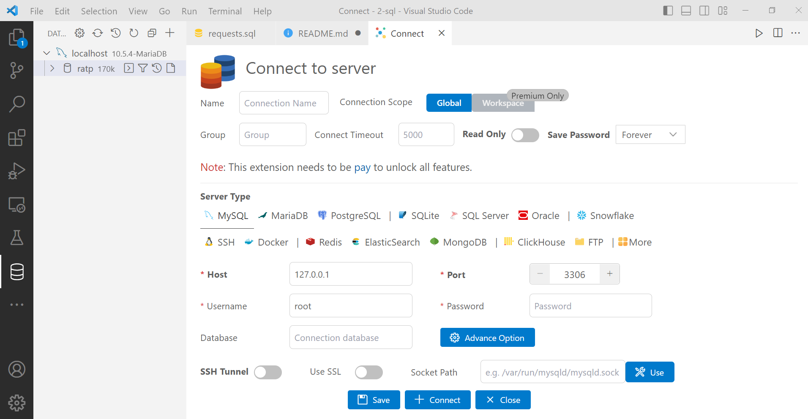

# MySQL

## Depuis VSCODE

1. Installez l'extension MySQL de Juan Han
2. Depuis l'icône de la base de données cf. image ci-dessous, configurez une connexion en saisissant le nom de l'utilisateur et son mot de passe. Laissez tous les options par défaut.

---

## Depuis un terminal

Dans les commandes ci-après `ratp` fait référence à une base de données.

### Connexion

`mysql -u [username] -p`

Remplacer [username] par le nom de l'utilisateur.

---

### Gestion des utilisateurs

Il faut au préalable être connecté avec un autre utilisateur, par exemple root ou un autre que vous avez créé entre temps.

#### Créer un utilisateur

`CREATE USER 'john'@'localhost' IDENTIFIED BY 'password';`

Remplacer password par le mot de passe souhaité.

#### Supprimer un utilisateur

`DROP USER 'john'@'localhost';`

#### Modifier le nom de l'utilisateur

`RENAME USER 'john'@'localhost' TO 'doe'@'localhost';`

#### Modifier le mot de passe

`SET PASSWORD FOR 'doe'@'localhost' = 'new password';`

---

### Gestion des privilèges

#### Donner des droits

Donner des droits restreints à un utilisateur sur une base de données 
WITH GRANT OPTION = Les droits qui lui ont été donnée, cet utilisateur peut les donner à d'autres utilisateurs. Une sorte d'héritage.

`GRANT INSERT, SELECT, UPDATE ON ratp.* TO 'user'@'localhost' WITH GRANT OPTION;`

#### Confirmer les droits

Confirmer la prise en compte des nouveaux droits 

`FLUSH PRIVILEGES;`

#### Voir les droits

`SHOW GRANTS FOR 'user'@'localhost';`

#### Révoquer les droits

`REVOKE ALL PRIVILEGES, GRANT OPTION FROM 'user'@'localhost';`

`REVOKE DELETE ON ratp.* FROM 'user'@'localhost';`

---

### Voir toutes les bases de données

`show databases;`

---

### Utiliser une base de données

`use ratp;`

---

### Voir les tables d'une base de données

`show tables;`

### Importer les données depuis un fichier SQL

1. `CREATE DATABASE ratp;`
2. `use ratp;`
3. `source chemin_absolue/vers/le/fichier.sql;`
